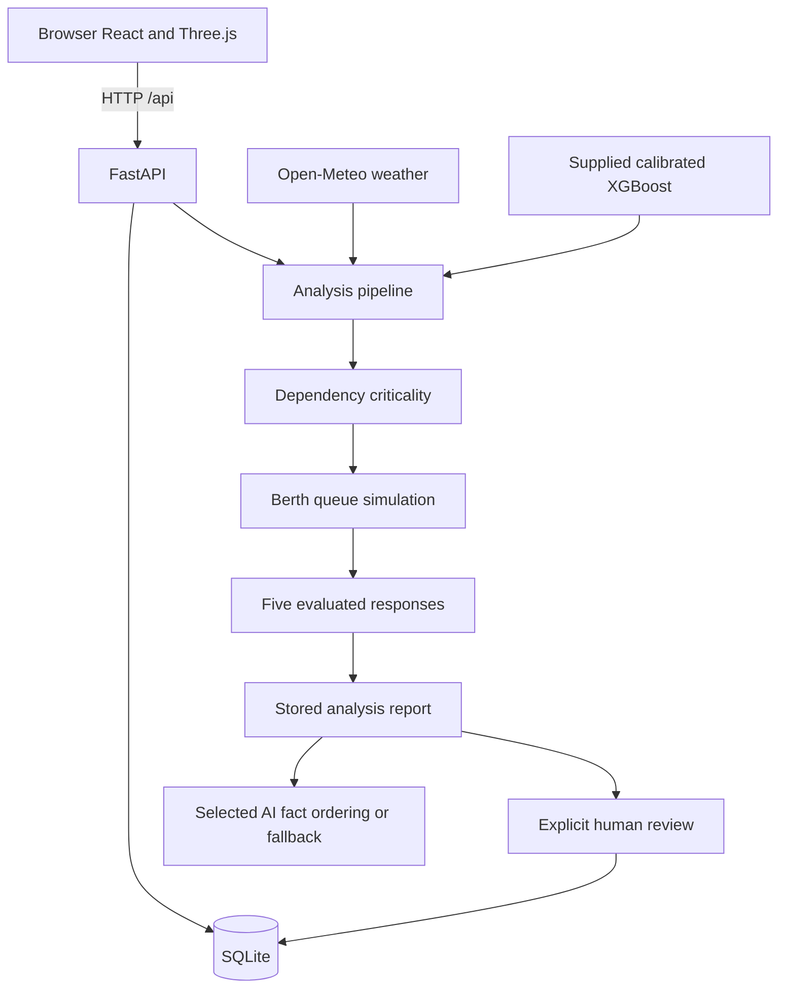

# Architecture

## System Architecture

The active application runs React/Vite on port 5173 and FastAPI on port 8000 with SQLite persistence. Vite proxies /api to FastAPI. The TypeScript backend under src/backend/src and standalone src/model-service are retained earlier implementations; the current setup does not start them.

## Components

| Component | Technology | Responsibility |
|---|---|---|
| Frontend | React, TypeScript, Vite, Three.js, SVG | Registers, illustrative scene, charts, point-wise explanations and decisions |
| API | FastAPI, Pydantic, Uvicorn | Typed routes and orchestration |
| Equipment inference | CalibratedClassifierCV over XGBClassifier | Numeric probabilities from the supplied artifact |
| Operational engines | Python | Dependencies, queues, alerts and ranked responses |
| Weather | HTTPX, Open-Meteo | Current/hourly normalization, cache and outage states |
| AI explanation | Groq, SambaNova or optional Bob adapter | Select/order allowed fact IDs; render exact backend text |
| Persistence | SQLite with WAL | Registers, revision, reports, decisions, audit and weather snapshots |

## Data Flow

1. GET /api/snapshot reads registers, simulation time, revision and prior decisions consistently.
2. WeatherService fetches current/hourly weather at 23.03 N, 70.22 E, validates ranges and converts units. It caches for ten minutes and backs off failures for one minute, returning stale or unavailable state.
3. Explicit model features take precedence. Simulated assets otherwise combine weather with health-interpolated machine features. When weather is unavailable, complete demo vectors are used. Operator-entered assets without model inputs expose unavailable inference.
4. The loader verifies the model checksum, recovers original embedded XGBoost bytes from an incompatible snapshot and retains saved sklearn calibration. Exactly sixteen features are required. Class-1 meaning and training preprocessing remain unconfirmed; the proxy weather-stress formula is derived from demo anchors.
5. Dependencies traverse supply assets, cranes, berths and vessels. Criticality combines confirmed risk or health exposure, cargo demand, six-hour arrivals and substitutes. It is an index, not a probability.
6. A deterministic single-server queue per berth uses arrival times, cargo demand, effective crane rates and vessel dimensions. Available current weather derates capacity; stale weather may enter the feature proxy but is not applied as current queue derating. Forecast samples cover 0–48h in six-hour steps; zero capacity causes lower-bound delays.
7. Five templates evaluate do nothing, repair, crane reassignment, vessel shift, and repair plus rebalance. Score = total vessel-delay hours + 0.1 × peak congestion index + 2 × effort units. Feasible options rank first, then lowest score. Repair assumes completion before the window; effort is not money.
8. Reports preserve analysis inputs and outputs. AI returns fact IDs, which the backend validates before assembling source text. Recommendation, authority and limitations are always included. Explanations can be added to stored reports without changing their calculation snapshot.
9. Approval checks report/revision and stores scenario, operator, timestamp, conditions and audit evidence. Modification selects an evaluated alternative; rejection creates no accepted plan. Accepted plans are marked not executed.
10. Register edits and simulation controls increment revisions. Crane deletion clears assignments and its mirrored Assets record; berth deletion rejects remaining dependencies. History is retained.

### API reference

All paths below begin with /api. Interactive schemas are at /docs.

| Method | Path | Purpose |
|---|---|---|
| GET | /health, /snapshot, /port/live | Service and operational state |
| GET, POST | /assets, /vessels, /berths, /cranes | Read/create records |
| PUT | /{register}/{id} | Revision-protected update |
| DELETE | /cranes/{id}, /berths/{id} | Revision-protected deletion |
| GET | /model/metadata | Model contract |
| POST | /model/predict | Inference from complete inputs |
| GET | /weather, /congestion, /dependencies, /alerts, /scenarios | Analytical outputs |
| GET | /recommendations/{report_id} | Persisted report |
| GET, POST | /approvals | History/pending or decision |
| GET | /operations, /audit | Accepted plans and recent audit |
| POST | /explanations, /simulation | Explanation or advance/degrade/repair/reset |

## Security Considerations

- Provider keys stay in backend environment variables; no keys belong in frontend VITE variables.
- Writes require X-PortSentinel-Client: ui and an optional X-Operator-Token. This is local demonstration protection, not production identity.
- Register writes/deletes require If-Match. Decisions check current report/revision and unique request IDs.
- SQLite transactions preserve changes and audit together. Deletes and reset preserve history.
- Provider requests use HTTPS, disabled redirects, timeouts and isolated credentials. Only allowed fact IDs are accepted.
- Checksum verification and restricted unpickling protect the supplied model-loading path. Do not substitute unrelated pickle files.

## Scalability Notes

The current deployment is local and single-instance. Shared SQLite state and process-local caches need redesign for horizontal scaling. Production use would need identity, permissions, validated model preprocessing, operational forecasting, telemetry integrations, backups and monitoring.

Earlier notes in implementation-report.md and sambanova-integration.md describe historical validation. This document describes the current code; live provider success should be checked in Settings and the explanation badge.
