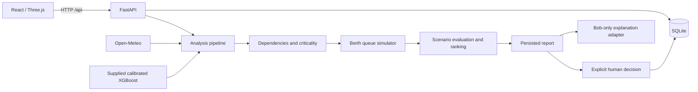

# Architecture and API reference

> Provider update: the user authorized SambaNova as an alternative to Bob. The active configuration is now SambaNova / Llama 3.3 70B. Earlier Bob-only descriptions below document the prior implementation. See [current SambaNova configuration](sambanova-integration.md). Live requests reached SambaNova, but inference is blocked by its payment-method requirement. No successful completion is claimed.

## Components

SQLite suits a single-machine hackathon demonstration without an extra service. FastAPI provides typed validation and OpenAPI documentation while keeping Python model inference in-process. React/Vite and Three.js preserve the existing frontend. Engines are separate classes so validated forecasting or deployment services can later replace heuristics without changing the locked product flow.

## Data ownership and consistency

`Store` persists registers, simulation time/revision, immutable analysis reports, decisions, audit events and provider weather snapshots. Register writes require `If-Match` revision. Approval uses a write transaction, current report/revision checks, a unique report constraint and idempotency key. The decision stores its scenario and model outputs in the audit; accepted plans are never dispatched to real systems. Reset replaces simulated records but retains historical reports/decisions/audit.

The local operator header prevents accidental unauthenticated form posts; an optional shared operator token gates mutations. This is not production user identity, role-based access or a deployment security boundary. Both servers bind to loopback in the documented setup.

## Model and weather boundaries

`FailureRiskModel` verifies the original SHA-256 before restricted unpickling, recovers the original XGBoost model bytes from incompatible snapshots, and retains the saved sklearn calibration. Exact engineered inputs are validated. It never retrains or silently fills missing features. Numeric class-1 probability is available; failure semantics and preprocessing remain unconfirmed.

`WeatherService` fetches Open-Meteo current/hourly modeled conditions at 23.03 N, 70.22 E, normalizes km/h to knots and metres to km, caches for ten minutes and backs off failed calls for one minute. Failures expose stale/unavailable state. Live weather has a separate clock from the simulated port. A current-wind heuristic derates queue capacity; future weather alerts use the forecast. No unverified live-weather transformation is passed into the failure model.

## Operational calculations

Dependencies traverse asset supply relationships, crane assignments and berth/vessel demand. Criticality weights confirmed risk (or health exposure while unconfirmed), cargo demand, six-hour arrivals and substitute availability. It is an index, not a probability.

The congestion engine uses a deterministic single-server queue per berth, ordered by arrival and priority ties. Crane handling rates are reduced by health, supply health, restrictions and explicit current-weather factors. Vessel dimensions gate compatibility. It returns 0–48h samples, utilization, waiting counts and total/average delays. Handling completion may extend beyond the plotted window. No-capacity cases report a lower bound at 48 hours. The engine does not claim learned port accuracy; units, assumptions and resource limits are exposed.

Five intervention templates share the same predictor. Score = total vessel-delay hours + 0.1 × peak congestion index + 2 × effort units. Lower is better among feasible candidates. Feasibility checks known assignments, available donors and vessel dimensions; cargo/lifting compatibility, pilot/tug availability and repair duration remain operator assumptions. Repair is optimistically assumed completed before the modeled window. Effort is not money. Scores do not represent a certified optimizer.

## Bob responsibility

Only `BobAPIService` can make an LLM request. It receives authoritative fact IDs/text and may return their order/selection. The backend validates allowed IDs, appends limitations and renders exact source text. Unknown facts or request failures trigger explicitly labeled deterministic explanations. Bob cannot calculate risk, invent outcomes, change rank or accept a plan. The conditional chat-completions transport is opt-in; real Bob endpoint/protocol/authentication remain to be verified from the team's contract. No alternate provider is configured.

## Endpoints

All paths begin `/api`. Interactive schemas are available at `/docs` on the backend.

| Method | Path | Purpose |
|---|---|---|
| GET | `/health` | Model/Bob configuration and authority status |
| GET | `/snapshot` | Consistent registers, analysis, decisions and services |
| GET | `/port/live` | Simulated state, dependencies, risks and forecasts |
| GET | `/assets`, `/vessels`, `/berths`, `/cranes` | Register records |
| POST | Same register paths | Create; `If-Match` required |
| PUT | `/{register}/{id}` | Update immutable ID; `If-Match` required |
| GET | `/model/metadata` | Actual artifact interface/checksum |
| POST | `/model/predict` | Actual prediction from all sixteen engineered features |
| GET | `/weather?refresh=false` | Normalized external weather |
| GET | `/congestion`, `/dependencies`, `/alerts`, `/scenarios` | Calculated operational outputs |
| GET | `/recommendations/{report_id}` | Persisted reproducible report |
| GET / POST | `/approvals` | Pending/history or explicit decision |
| GET | `/operations`, `/audit` | Accepted plans and recent audit events |
| POST | `/explanations` | Bob request or explicit fallback for a report |
| POST | `/simulation` | Advance, degrade, repair or reset simulated state |

Mutation requests require `X-PortSentinel-Client: ui` and, when configured, `X-Operator-Token`. Decision JSON includes `report_id`, `scenario_id`, `status`, `comment`, `request_id`. Duplicate identical requests return the existing outcome; conflicting duplicates and stale inputs return 409.
