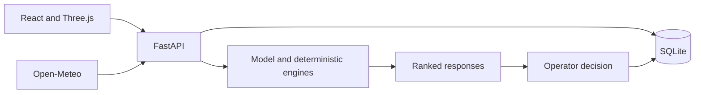

# Solution Overview

## What We Built

PortSentinel Nexus is a local port-resilience decision-support prototype with Home, Live Port View, Alerts, Approvals, Congestion, Weather, Assets, Vessels, Berths and Cranes modules. Operators inspect simulated operations, edit records, compare responses and record decisions.

## How It Works

1. Read operational registers and simulation time from SQLite and fetch external weather.
2. Run the supplied classifier on explicit engineered inputs or a weather-and-health proxy for simulated assets.
3. Traverse asset, crane, berth and vessel dependencies and calculate operational criticality.
4. Simulate berth queues, generate alerts and evaluate five responses using the same predictor.
5. Show ranked outcomes and a point-wise explanation. The selected LLM may order backend facts, but cannot alter calculations or approve actions.
6. Persist approval, an evaluated alternative or rejection with conditions, scenario details and audit history.

Crane deletion clears assignments and its matching Assets entry. Berth deletion requires reassigning dependent records. Both preserve previous reports and decisions.

## Architecture Diagram

See [architecture.md](architecture.md) for details.

## Key Design Decisions

| Decision | Rationale |
|---|---|
| Python inference inside FastAPI | Keeps the supplied model and operational engines in one process |
| SQLite | Durable local state without a database server |
| One queue predictor for all responses | Consistent outcome comparison |
| Stored reports and revision checks | Links decisions to the inputs reviewed |
| Constrained AI fact ordering | Preserves backend numbers and human authority |
| Explicit source and outage labels | Separates simulated operations, external weather and AI output |

## IBM Technologies Used

The repository includes an optional BobAPIService explanation adapter requiring a verified IBM endpoint, protocol, model and credentials. Successful IBM inference and Bob-assisted development history are not claimed. Groq and SambaNova are separate adapters, not IBM technologies. Confirm any IBM-specific eligibility requirements with the organizers.
